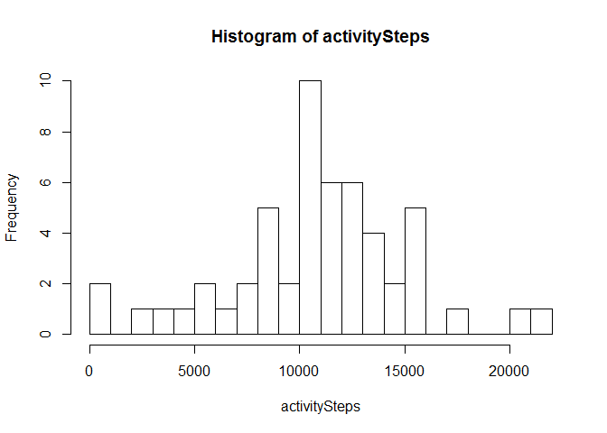
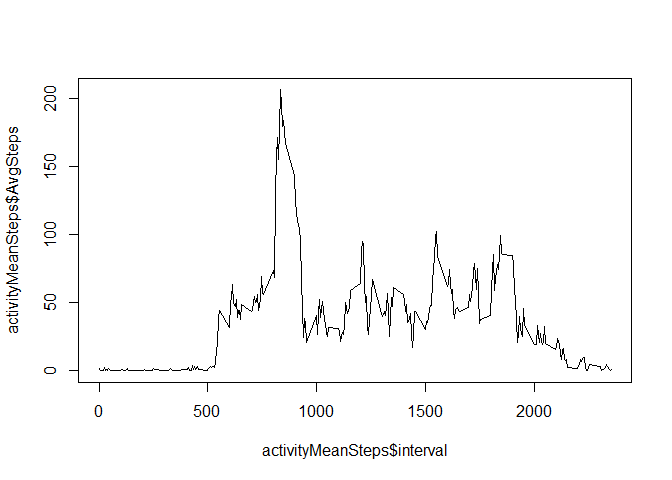
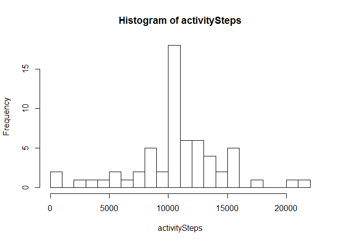
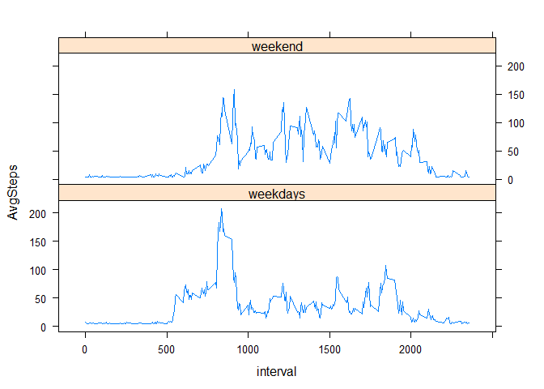

# Reproducible Research: Peer Assessment 1


## Loading and preprocessing the data
Save data frame from CSV file into variable and format date column

```r
activity <- read.csv("activity.csv")
activity$date <- as.Date(activity$date)
```

## What is mean total number of steps taken per day?

Histogram of the total number of steps taken each day

```r
activitySteps <- tapply(activity$steps, activity$date, sum)
hist(activitySteps, breaks = 20)
```

<!-- -->

Mean and median total number of steps taken per day

```r
summary(activitySteps)
```

```
##    Min. 1st Qu.  Median    Mean 3rd Qu.    Max.    NA's 
##      41    8841   10760   10770   13290   21190       8
```

Remove NAs

```r
activity2 <- activity[!is.na(activity$steps),]

library(sqldf)
```

```
## Warning: package 'sqldf' was built under R version 3.2.5
```

```
## Loading required package: gsubfn
```

```
## Warning: package 'gsubfn' was built under R version 3.2.5
```

```
## Loading required package: proto
```

```
## Loading required package: RSQLite
```

```
## Warning: package 'RSQLite' was built under R version 3.2.5
```

```r
activityByDay <- sqldf("
        SELECT sum(steps) AS SumSteps, date
        FROM activity2
        GROUP by date
       ")
```

```
## Loading required package: tcltk
```

```
## Warning: Quoted identifiers should have class SQL, use DBI::SQL() if the
## caller performs the quoting.
```


## What is the average daily activity pattern?

Time series plot (i.e.  type = "l" ) of the 5-minute interval (x-axis) and the average
number of steps taken, averaged across all days (y-axis)

```r
activityMeanSteps <- sqldf("
        SELECT avg(steps) AS AvgSteps, interval
        FROM activity2
        GROUP by interval
       ")
plot(activityMeanSteps$interval,activityMeanSteps$AvgSteps, type = "l")
```

<!-- -->

Which 5-minute interval, on average across all the days in the dataset, contains 
the maximum number of steps?

```r
sqldf("
        SELECT max(AvgSteps) AS AvgSteps, interval
        FROM activityMeanSteps
       ")
```

```
##   AvgSteps interval
## 1 206.1698      835
```

## Imputing missing values

Total number of missing values in the dataset (i.e. the total number of rows 
with  NA s)

```r
sum(is.na(activity$steps))
```

```
## [1] 2304
```

Create a new dataset that is equal to the original dataset but with 
the missing data filled in

```r
mean(activity$steps, na.rm = T)
```

```
## [1] 37.3826
```

```r
activity3 <- activity
activity3$steps[is.na(activity3$steps)] <- mean(activity3$steps, na.rm = T)
colSums(is.na(activity3))
```

```
##    steps     date interval 
##        0        0        0
```

histogram of the total number of steps taken each day and Calculate and 
report the mean and median total number of steps taken per day.

```r
activitySteps <- tapply(activity3$steps, activity3$date, sum)
hist(activitySteps, breaks = 20)
```

<!-- -->

Do these values differ from the estimates from the first part of the assignment? 

Answer: Yes

What is the impact of imputing missing data on the estimates of the total 
daily number of steps?

Answer: Frequencies are lowered accross days.

## Are there differences in activity patterns between weekdays and weekends?

Create a new factor variable in the dataset with two levels -- "weekday" 
and "weekend" indicating whether a given date is a weekday or day.
weekend 

```r
activity3$weekdays <- weekdays(activity3$date)
activity3$weeks[(activity3$weekdays == "Saturday" | activity3$weekdays == "Sunday")] <- "weekend"
activity3$weeks[!(activity3$weekdays == "Saturday" | activity3$weekdays == "Sunday")] <- "weekdays"
```

Panel plot containing a time series plot (i.e.  type = "l" ) of the 5-minute 
interval (x-axis) and the average number of steps taken, averaged across 
all weekday days or weekend days (y-axis). 

```r
activityMeanSteps <- sqldf("
        SELECT avg(steps) AS AvgSteps, interval, weeks
        FROM activity3
        GROUP by weeks, interval 
       ")

library(lattice)
xyplot(AvgSteps ~ interval | weeks, data = activityMeanSteps, type = "l", layout = c(1, 2))
```

<!-- -->
